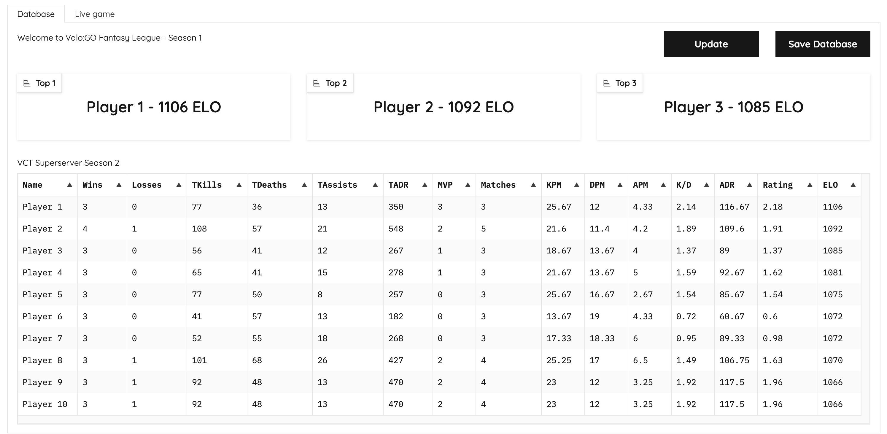

# [CS:GO Autistic Simulator](https://github.com/zachnguyen03/fps-fantasy-league)
Season 4 LIVE!

by anhster (in development stage)

## :electron: Why? :electron:
I'm a diehard Esports fan, especially Valorant esports, but the number of matches in a VCT season is diabolical. I'm also autistic, and I hate playing the game. Solution? Making my own fantasy league

## :tada: Introduction :tada:
This is a simple UI for an FPS fantasy league I'm hosting. I love working with data, so I'm using this fantasy league to get into data analytics. We can pretty much customize our own players, metrics, evaluation systems based on our preferences. In my case, I gathered some CS:GO and Valorant pro players, made a custom botprofile.db for CS:GO with custom skill levels for each player, and do matchmaking for 10 bots (yes, I enjoy watching 10 computer-controlled characters play a competitive game of CS:GO). And why CS:GO and not CS2 or Valorant? Because you can actually customize the bots in CS:GO, while CS2 bots are ass and Valorant doesn't even have one

## :hammer_and_wrench: Installation :hammer_and_wrench:

Requirements

The following installation suppose `python=3.9` `gradio` 

- Clone the repository

  ```
  git clone https://github.com/zachnguyen03/fps-fantasy-league.git
  cd fps-fantasy-league
  ```

- Environment Installation
  ```
  conda create -n vct python=3.9
  conda activate vct
  pip install -r requirements.txt
  ```

- Initialize the UI
  ```
  python web_app.py
  ```

- User interface preview 

## :nut_and_bolt: Inference :nut_and_bolt:
- [x] Tweaked UI
- [x] Create live game + update scoreboard
- [x] ELO system
- [x] Enhanced ELO system with performance-driven scores
- [x] OCR integration for automatic scoreboard logging using uploaded screenshot 
- [x] Advanced Matchmaking Logic
- [x] Database Integration
- [x] Player + Map Stats + Match History Available
- [ ] Live Integration with game API
- [ ] Advanced statistics summary
